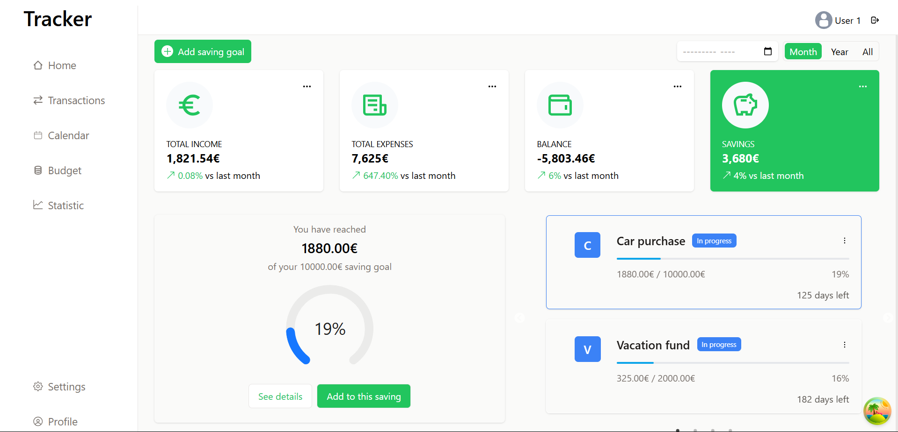
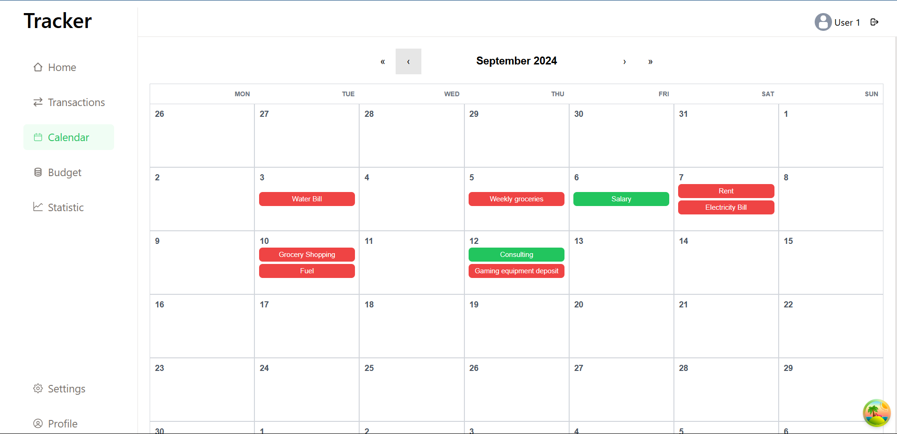
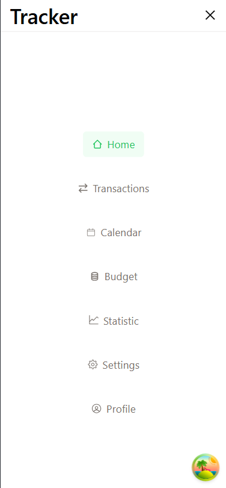

# 💸 Expense Tracker App

Expense tracking app built with React, Vite, and Tailwind CSS. This application enables users to efficiently manage their finances by tracking income and expenses, setting and monitoring savings goals, creating budgets, and viewing detailed statistics. It includes a calendar feature for tracking transaction dates and provides insights into monthly and yearly financial data.

## 📑 **Table of Contents**

- [💸 Expense Tracker App](#-expense-tracker-app)
- [🔗 Backend Repository](#-backend-repository)
- [📋 Features](#-features)
- [🎨 Gallery](#-gallery)
- [✨ Demo](#demo)
- [🛠️ Technologies Used](#-technologies-used)

## 🔗 **Backend Repository**

Please note, the backend for this application is located in a separate repository. You can access it here:  
👉 [Backend Repository Link](https://github.com/jovana623/expense_tracker_api)

## 📋 **Features**

- **Track Income & Expenses**: Easily add, edit, and categorize your transactions.
- **Savings Goals**: Set personal savings goals and monitor your progress.
- **Budgets**: Create budgets for various categories like groceries, entertainment, etc.
- **Detailed Statistics**: View financial trends, summaries, and category-wise expenses.
- **Calendar**: Keep track of your transactions by date.
- **Responsive Design**: Fully responsive design, optimized for both desktop and mobile use.

## 🎨 **Gallery**

Check out the interface and features of the app below:

  
  
  
  
  
  
  
  
  

## ✨ **Demo**

Here’s a quick demo of the app in action:

## 🛠️ **Technologies Used**

- **React**
- **Vite**
- **Tailwind CSS**
- **React Query**
- **React Router**
- **Recharts**
- **Vitest**
